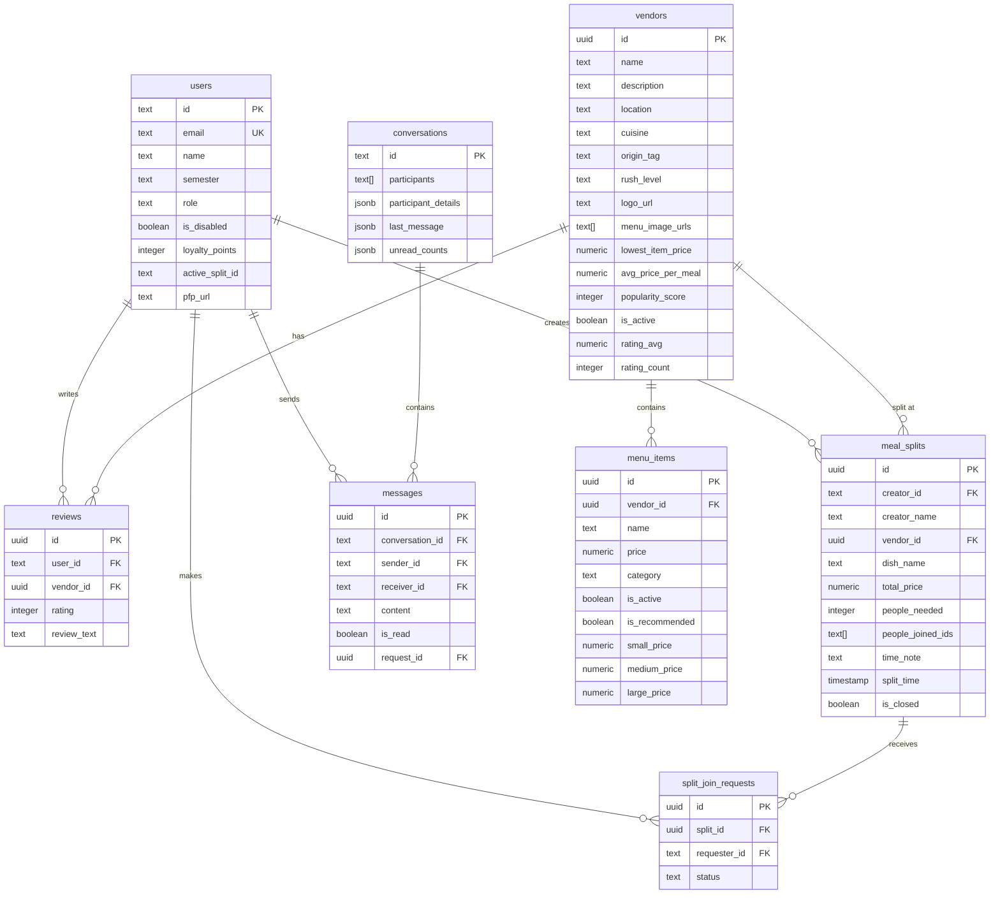
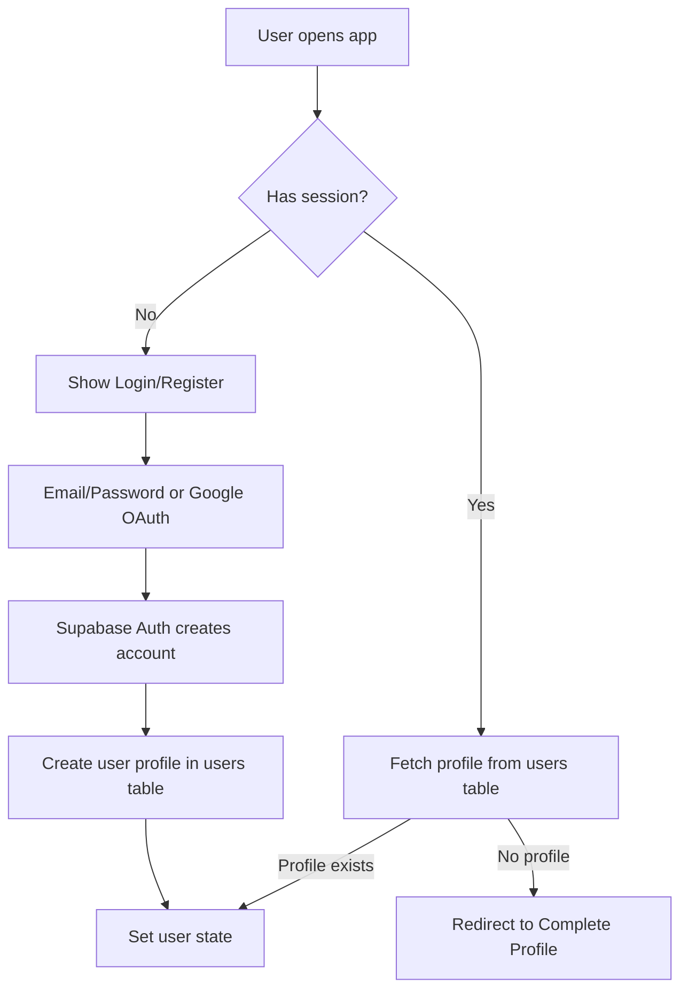
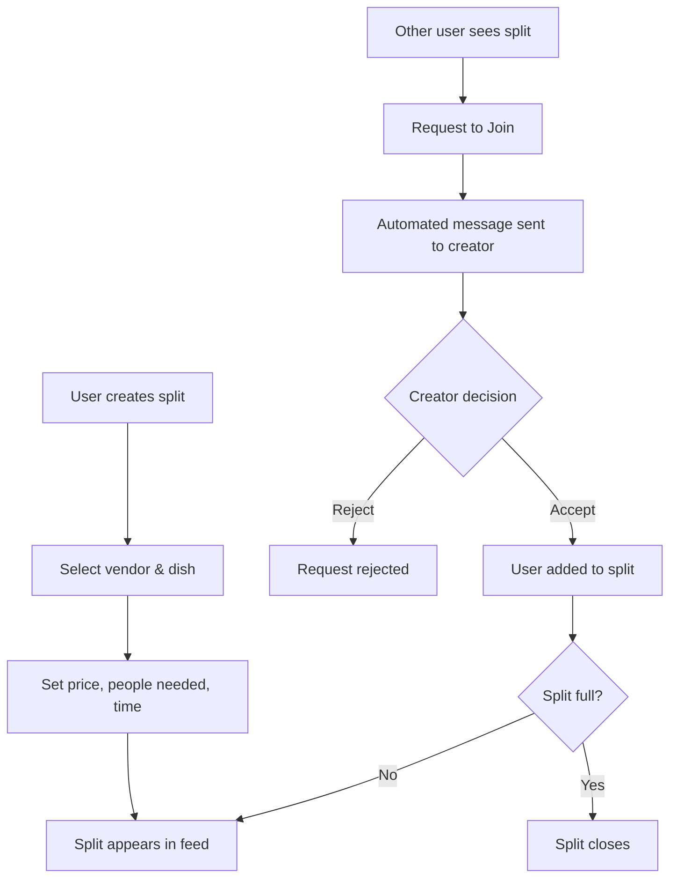
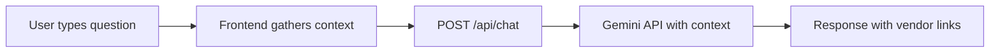
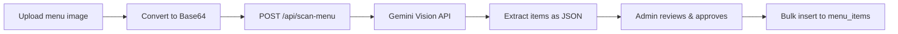

<p align="center">
  
</p>

<h1 align="center">Food-Hunt</h1>
<h3 align="center">Find Food, Find Friends.</h3>


## Tech Stack Overview

| Layer | Technology | Purpose |
|-------|-----------|---------|
| **Frontend** | React 19 + TypeScript | Modern UI with hooks |
| **Build Tool** | Vite 6 | Fast HMR development |
| **Routing** | React Router DOM 7 | Hash-based SPA routing |
| **Backend (BaaS)** | Supabase | PostgreSQL + Auth + Realtime |
| **AI/ML** | Google Gemini API | Chatbot + Menu OCR scanning |
| **Push Notifications** | Firebase Cloud Messaging | Real-time notifications |
| **Analytics** | Vercel Analytics | User tracking |
| **Icons** | Lucide React | Icon library |
| **Deployment** | Vercel | Serverless hosting |

---

## Project Structure

```
Food-Hunt/
├── api/                    # Serverless API handlers (Vercel)
│   ├── chat.js            # AI chatbot endpoint
│   ├── scan-menu.js       # Menu image OCR
│   └── send-push.js       # Push notification sender
├── components/
│   ├── Chatbot.tsx        # AI assistant widget
│   ├── Navbar.tsx         # Navigation bar
│   ├── ConfirmationModal.tsx
│   └── CookieBanner.tsx
├── contexts/
│   ├── AuthContext.tsx    # Authentication state
│   └── ThemeContext.tsx   # Dark/light mode
├── hooks/
│   └── usePushNotifications.ts
├── pages/                  # 15 page components
│   ├── Home.tsx           # Landing page
│   ├── VendorList.tsx     # Browse vendors
│   ├── VendorDetail.tsx   # Vendor page + reviews + menu
│   ├── MealSplits.tsx     # Meal splitting feature
│   ├── Inbox.tsx          # Real-time chat
│   ├── Profile.tsx        # User profile
│   ├── AdminDashboard.tsx # Admin stats
│   ├── AdminVendors.tsx   # Vendor management
│   └── AdminUsers.tsx     # User management
├── services/
│   ├── supabase.ts        # Supabase client init
│   ├── firebase.ts        # Firebase init
│   ├── mockDatabase.ts    # API service layer (1100+ lines)
│   ├── geminiService.ts   # AI service wrapper
│   └── seeder.ts          # Database seeder
├── App.tsx                # Main router
├── types.ts               # TypeScript interfaces
└── supabase_schema.sql    # Database schema + RLS
```

---

## Database Schema (Supabase/PostgreSQL)



---

## Core Features & Workflows

### 1. Authentication Flow



**Key file:** [AuthContext.tsx](file:///c:/Important/Code/Food-Hunt/contexts/AuthContext.tsx)
- Uses Supabase Auth for email/password and Google OAuth
- Maintains `needsCompletion` flag for OAuth users needing profile setup
- Syncs auth state with `users` table profile

---

### 2. Vendor Discovery

Users can browse food vendors with filtering and sorting:
- **Origin filters**: North, South, West, Chinese, Indo-Chinese
- **Rush level indicators**: Low/Mid/High crowd levels
- **Sorting**: By rating, price, popularity

**Key file:** [VendorList.tsx](file:///c:/Important/Code/Food-Hunt/pages/VendorList.tsx)

---

### 3. Vendor Details & Reviews

Each vendor page shows:
- Contact info, location, cuisine type
- **Dynamic menu** with category sections and size variants (S/M/L pricing)
- **Reviews system** with star ratings (1-5) and text
- Review submission awards +5 loyalty points

**Key file:** [VendorDetail.tsx](file:///c:/Important/Code/Food-Hunt/pages/VendorDetail.tsx)

---

### 4. Meal Splitting System

The core social feature allowing students to share meals:



**Key file:** [MealSplits.tsx](file:///c:/Important/Code/Food-Hunt/pages/MealSplits.tsx)

**Business rules:**
- Rate limit: 5 join requests per 3-hour slot
- Time conflict: Can't create splits within 4 hours of existing ones
- Closed splits hidden from non-members

---

### 5. Real-Time Chat (Inbox)

Powered by Supabase Realtime subscriptions:
- 1:1 conversations between users
- Automated messages for split join requests
- Inline Accept/Reject buttons for pending requests
- Unread count tracking

**Key file:** [Inbox.tsx](file:///c:/Important/Code/Food-Hunt/pages/Inbox.tsx)

---

### 6. AI Chatbot (FoodieBot)



**Context includes:**
- All vendors with ratings and pricing
- Menu items per vendor
- Recent reviews (last 20)
- Active meal splits

**Key file:** [Chatbot.tsx](file:///c:/Important/Code/Food-Hunt/components/Chatbot.tsx) + [chat.js](file:///c:/Important/Code/Food-Hunt/api/chat.js)

---

### 7. AI Menu Scanning

Admin can upload menu images for automatic item extraction:



**Extracts:** Name, category, price, size variants (S/M/L/XL)

**Key file:** [scan-menu.js](file:///c:/Important/Code/Food-Hunt/api/scan-menu.js)

---

### 8. Admin Panel

Three admin pages for platform management:

| Page | Features |
|------|----------|
| **Dashboard** | User stats, vendor count, review metrics |
| **Vendors** | Add/edit vendors, manage menus, upload images, AI scan |
| **Users** | View users, assign roles, sort by activity, disable accounts |

**Sorting options:** Creation date, loyalty points, splits created, reviews, inbox activity

---

### 9. Push Notifications

Firebase Cloud Messaging for:
- New chat messages
- Split join request responses
- New member signup alerts (to admin)

**Key file:** [usePushNotifications.ts](file:///c:/Important/Code/Food-Hunt/hooks/usePushNotifications.ts) + [send-push.js](file:///c:/Important/Code/Food-Hunt/api/send-push.js)

---

## API Service Layer

The [mockDatabase.ts](file:///c:/Important/Code/Food-Hunt/services/mockDatabase.ts) file (1100+ lines) is the central API layer:

```typescript
export const api = {
  users: {
    getMe(), updateProfile(), getActivity(), search()
  },
  vendors: {
    getAll(), getById(), getReviews(), addReview(),
    getMenuItems(), updateMenuItem(), addMenuItem(),
    deleteMenuItem(), setRecommendedItem(), deleteReview()
  },
  menus: { getAll() },
  reviews: { getRecent() },
  splits: {
    getAll(), create(), join(), leave(), getById(),
    requestJoin(), cancelRequest(), respondToRequest(),
    getMyRequests(), markComplete()
  },
  messages: {
    getConversations(), getMessages(), send(), markAsRead()
  },
  // Admin endpoints...
}
```

**Key patterns:**
- All methods return `GenericResponse<T>` with `{success, message, data?}`
- Supabase client handles RLS security
- Cascading updates (e.g., recalculating vendor stats after menu changes)
- Dynamic popularity calculation based on ratings + engagement

---

## Row Level Security (RLS)

Database security via PostgreSQL RLS policies:

| Table | SELECT | INSERT | UPDATE | DELETE |
|-------|--------|--------|--------|--------|
| users | Public | Own ID | Own ID | - |
| vendors | Public | Admin | Admin | Admin |
| reviews | Public | Authenticated | Own | Own |
| menu_items | Public | Admin | Admin | Admin |
| meal_splits | Authenticated | Authenticated | Authenticated | Creator |
| conversations | Participant | Authenticated | Participant | - |
| messages | Sender/Receiver | Sender | - | - |
| split_join_requests | Requester/Creator | Requester | Creator | Requester |

---

## User Roles

```typescript
enum UserRole {
  STUDENT = 'student',  // Default role
  ADMIN = 'admin',      // Full platform access
  VENDOR = 'vendor'     // Vendor dashboard access
}
```

---

## Key Dependencies

| Package | Version | Purpose |
|---------|---------|---------|
| `react` | 19.2.0 | UI framework |
| `vite` | 6.2.0 | Build tool |
| `@supabase/supabase-js` | 2.86.2 | Backend client |
| `firebase` | 12.6.0 | Push notifications |
| `@google/generative-ai` | 0.24.1 | Gemini AI |
| `react-router-dom` | 7.9.6 | Routing |
| `lucide-react` | 0.554.0 | Icons |
| `@vercel/analytics` | 1.6.1 | Analytics |

---

## Development Commands

```bash
npm run dev      # Start Vite dev server
npm run build    # Production build
npm run preview  # Preview production build
```

---

## Deployment

Deployed on **Vercel** with:
- Frontend: Static files from `dist/`
- API routes: Serverless functions in `api/`
- Environment variables for Supabase & Gemini keys
