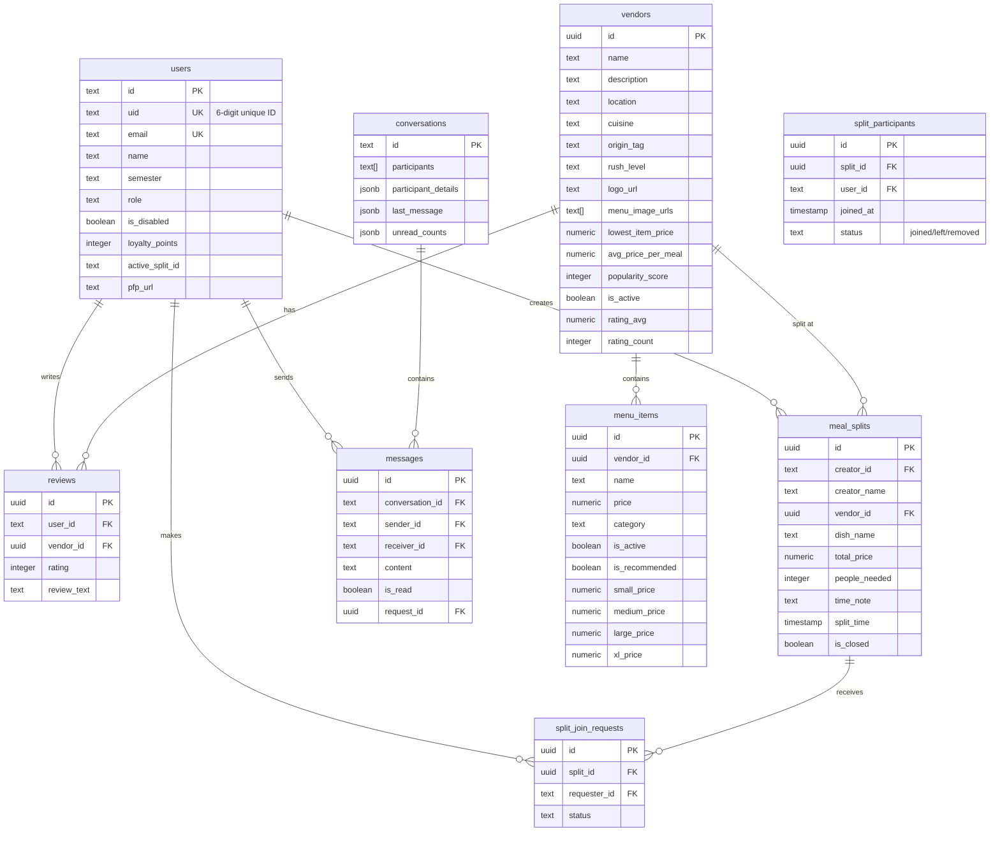
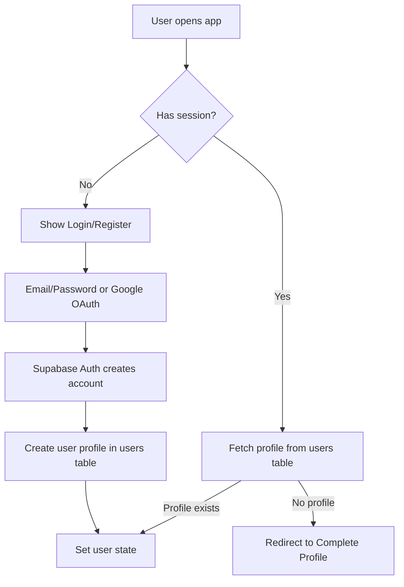
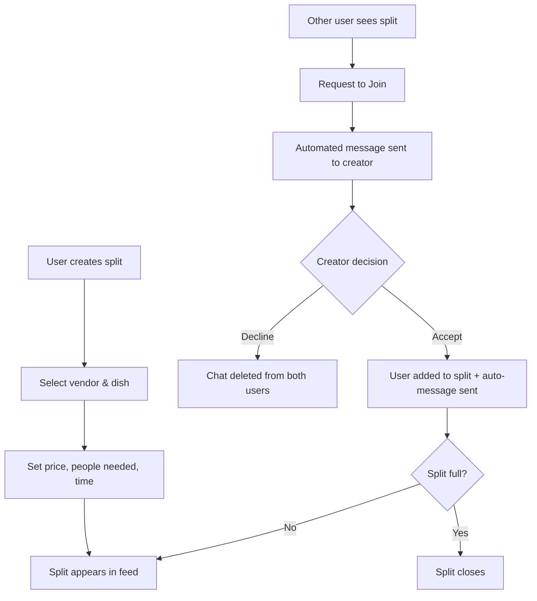
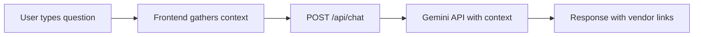
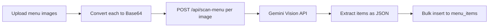

<p align="center">
  
</p>

<h1 align="center">Food-Hunt</h1>
<h3 align="center">Find Food, Find Friends.</h3>

## Tech Stack Overview

| Layer                  | Technology                    | Purpose                               |
| ---------------------- | ----------------------------- | ------------------------------------- |
| **Frontend**           | React 19 + TypeScript         | Modern UI with hooks                  |
| **Build Tool**         | Vite 6                        | Fast HMR development                  |
| **Routing**            | React Router DOM 7            | Hash-based SPA routing                |
| **Backend (BaaS)**     | Supabase                      | PostgreSQL + Auth + Realtime          |
| **AI/ML**              | Google Gemini API             | Chatbot + Menu OCR scanning           |
| **Push Notifications** | Firebase Cloud Messaging      | Real-time notifications               |
| **Image Handling**     | Canvas API + Supabase Storage | Client-side compression & upload      |
| **Icons**              | Lucide React                  | Icon library                          |
| **Deployment**         | Cloudflare Pages              | Static hosting + serverless functions |

---

## Project Structure

```
Food-Hunt/
├── android/                # Capacitor Android project
├── api/                    # Serverless API handlers (local dev)
│   ├── chat.js            # AI chatbot endpoint
│   ├── scan-menu.js       # Menu image OCR
│   └── send-push.js       # Push notification sender
├── functions/api/          # Cloudflare Pages Functions (production)
│   ├── chat.js            # AI chatbot endpoint
│   ├── scan-menu.js       # Menu image OCR
│   └── send-push.js       # Push notification sender
├── components/
│   ├── Chatbot.tsx        # AI assistant widget
│   ├── Navbar.tsx         # Navigation bar
│   ├── MegaFooter.tsx     # Rich footer with navigation
│   ├── ConfirmationModal.tsx
│   ├── CookieBanner.tsx
│   ├── PageTransition.tsx # Animation wrapper
│   └── ui/                 # Reusable UI component library
│       ├── Button.tsx
│       ├── Card.tsx
│       ├── ImageUpload.tsx # Drag-and-drop image upload with compression
│       ├── Input.tsx
│       ├── Select.tsx
│       ├── ConfirmationModal.tsx
│       └── LoadingSpinner.tsx
├── contexts/
│   ├── AuthContext.tsx    # Authentication state + UID generation
│   └── ThemeContext.tsx   # Dark/light/system mode
├── hooks/
│   └── usePushNotifications.ts
├── pages/                  # 19 page components
│   ├── Home.tsx           # Landing page
│   ├── VendorList.tsx     # Browse vendors with filters
│   ├── VendorDetail.tsx   # Vendor page + reviews + menu
│   ├── MealSplits.tsx     # Meal splitting feature
│   ├── Inbox.tsx          # Real-time chat with UID search
│   ├── Profile.tsx        # User profile with UID display
│   ├── AdminDashboard.tsx # Admin stats
│   ├── AdminVendors.tsx   # Vendor management + AI scan
│   ├── AdminUsers.tsx     # User management
│   ├── AboutUs.tsx        # Developer info + social links
│   ├── HelpCenter.tsx     # Direct chat with admin
│   ├── Careers.tsx        # Placeholder page
│   ├── OurTeam.tsx        # Placeholder page
│   ├── PrivacyPolicy.tsx  # Full privacy policy
│   └── TermsAndConditions.tsx # Terms of service
├── services/
│   ├── supabase.ts        # Supabase client init
│   ├── firebase.ts        # Firebase init
│   ├── mockDatabase.ts    # API service layer (1400+ lines)
│   ├── geminiService.ts   # AI service wrapper
│   └── seeder.ts          # Database seeder
├── utils/
│   ├── sanitize.ts        # Input validation & sanitization
│   ├── compressImage.ts   # Client-side image compression (Canvas API)
│   └── uploadImage.ts     # Supabase Storage upload helper
├── tests/
│   └── split_limit.test.ts # Split feature tests
├── App.tsx                # Main router
├── types.ts               # TypeScript interfaces
├── capacitor.config.ts    # Android app config
└── supabase_schema.sql    # Database schema + RLS
```

---

## Database Schema (Supabase/PostgreSQL)


```mermaid
erDiagram
    users ||--o{ reviews : writes
    users ||--o{ meal_splits : creates
    users ||--o{ messages : sends
    users ||--o{ split_join_requests : makes
    vendors ||--o{ reviews : has
    vendors ||--o{ menu_items : contains
    vendors ||--o{ meal_splits : "split at"
    meal_splits ||--o{ split_join_requests : receives
    conversations ||--o{ messages : contains

    users {
        text id PK
        text uid UK "6-digit unique ID"
        text email UK
        text name
        text semester
        text role
        boolean is_disabled
        integer loyalty_points
        text active_split_id
        text pfp_url
    }
    vendors {
        uuid id PK
        text name
        text description
        text location
        text cuisine
        text origin_tag
        text rush_level
        text logo_url
        text[] menu_image_urls
        numeric lowest_item_price
        numeric avg_price_per_meal
        integer popularity_score
        boolean is_active
        numeric rating_avg
        integer rating_count
    }
    menu_items {
        uuid id PK
        uuid vendor_id FK
        text name
        numeric price
        text category
        boolean is_active
        boolean is_recommended
        numeric small_price
        numeric medium_price
        numeric large_price
        numeric xl_price
    }
    reviews {
        uuid id PK
        text user_id FK
        uuid vendor_id FK
        integer rating
        text review_text
    }
    meal_splits {
        uuid id PK
        text creator_id FK
        text creator_name
        uuid vendor_id FK
        text dish_name
        numeric total_price
        integer people_needed
        text time_note
        timestamp split_time
        boolean is_closed
    }
    split_participants {
        uuid id PK
        uuid split_id FK
        text user_id FK
        timestamp joined_at
        text status "joined/left/removed"
    }
    conversations {
        text id PK
        text[] participants
        jsonb participant_details
        jsonb last_message
        jsonb unread_counts
    }
    messages {
        uuid id PK
        text conversation_id FK
        text sender_id FK
        text receiver_id FK
        text content
        boolean is_read
        uuid request_id FK
    }
    split_join_requests {
        uuid id PK
        uuid split_id FK
        text requester_id FK
        text status
    }
```

---

## Core Features & Workflows

### 1. Authentication Flow


```mermaid
flowchart TD
    A[User opens app] --> B{Has session?}
    B -->|Yes| C[Fetch profile from users table]
    B -->|No| D[Show Login/Register]
    C -->|Profile exists| E[Set user state]
    C -->|No profile| F[Redirect to Complete Profile]
    D --> G[Email/Password or Google OAuth]
    G --> H[Supabase Auth creates account]
    H --> I[Create user profile in users table]
    I --> E
```

**Key file:** [AuthContext.tsx](file:///c:/Important/Code/Food-Hunt/contexts/AuthContext.tsx)

- Uses Supabase Auth for email/password and Google OAuth
- Maintains `needsCompletion` flag for OAuth users needing profile setup
- Syncs auth state with `users` table profile
- Uses `isAuthInProgress` ref guard to prevent race conditions between `onAuthStateChange` listener and in-flight signup/login (avoids false `needsCompletion` redirect when the profile row hasn't been inserted yet)

---

### 2. Vendor Discovery

Users can browse food vendors with filtering and sorting:

- **Origin filters**: North, South, West, Chinese, Indo-Chinese
- **Rush level indicators**: Low/Mid/High crowd levels
- **Sorting**: By rating, price, popularity

**Key file:** [VendorList.tsx](file:///c:/Important/Code/Food-Hunt/pages/VendorList.tsx)

---

### 3. Vendor Details & Reviews

Each vendor page shows:

- Contact info, location, cuisine type
- **Dynamic menu** with category sections and size variants (S/M/L/XL pricing)
- **Reviews system** with star ratings (1-5) and text
- Review submission awards +5 loyalty points

**Key file:** [VendorDetail.tsx](file:///c:/Important/Code/Food-Hunt/pages/VendorDetail.tsx)

---

### 4. Meal Splitting System

The core social feature allowing students to share meals:


```mermaid
flowchart TD
    A[User creates split] --> B[Select vendor & dish]
    B --> C[Set price, people needed, time]
    C --> D[Split appears in feed]
    E[Other user sees split] --> F[Request to Join]
    F --> G[Automated message sent to creator]
    G --> H{Creator decision}
    H -->|Accept| I[User added to split + auto-message sent]
    H -->|Decline| J[Chat deleted from both users]
    I --> K{Split full?}
    K -->|Yes| L[Split closes]
    K -->|No| D
```

**Key file:** [MealSplits.tsx](file:///c:/Important/Code/Food-Hunt/pages/MealSplits.tsx)

**Business rules:**

- Rate limit: 5 join requests per 3-hour slot
- Time conflict: Can't create splits within 4 hours of existing ones
- Closed splits hidden from non-members
- **Expired splits** auto-deleted when the page loads (past `split_time`)
- **Accept** sends auto-message: _"Hey! Great news 🎉 I'd be delighted to have you join my split!"_
- **Decline** deletes the entire conversation from both users' inboxes
- Accept/Decline buttons hidden for expired splits (shows "Split expired" label)
- Profile auto-clears `active_split_id` if the linked split is expired

---

### 5. Real-Time Chat (Inbox)

Powered by Supabase Realtime subscriptions:

- 1:1 conversations between users
- Automated messages for split join requests
- Inline Accept/Reject buttons for pending requests
- Unread count tracking
- **UID-based user search** (search by 6-digit unique ID)
- Vendor mention autocomplete with `@`

**Key file:** [Inbox.tsx](file:///c:/Important/Code/Food-Hunt/pages/Inbox.tsx)

---

### 6. AI Chatbot (FoodieBot)


```mermaid
flowchart LR
    A[User types question] --> B[Frontend gathers context]
    B --> C[POST /api/chat]
    C --> D[Gemini API with context]
    D --> E[Response with vendor links]
```

**Context includes:**

- All vendors with ratings and pricing
- Menu items per vendor
- Recent reviews (last 20)
- Active meal splits

**Key file:** [Chatbot.tsx](file:///c:/Important/Code/Food-Hunt/components/Chatbot.tsx) + [chat.js](file:///c:/Important/Code/Food-Hunt/api/chat.js)

---

### 7. AI Menu Scanning

Admin can upload **multiple** menu images for automatic item extraction:


```mermaid
flowchart LR
    A[Upload menu images] --> B[Convert each to Base64]
    B --> C[POST /api/scan-menu per image]
    C --> D[Gemini Vision API]
    D --> E[Extract items as JSON]
    E --> F[Bulk insert to menu_items]
```

**Extracts:** Name, category (from section headings), price, size variants (S/M/L/XL)

**Key files:** [scan-menu.js](file:///c:/Important/Code/Food-Hunt/functions/api/scan-menu.js) + [AdminVendors.tsx](file:///c:/Important/Code/Food-Hunt/pages/AdminVendors.tsx)

---

### 8.5. Unique User IDs (UID)

Each user receives a unique 6-digit ID on account creation:

- Generated randomly with collision checking
- Displayed on user profiles
- Searchable in Inbox for easy user discovery
- Format: `170467`, `293841`, etc.

**Key file:** [AuthContext.tsx](file:///c:/Important/Code/Food-Hunt/contexts/AuthContext.tsx) - `generateUniqueUid()`

---

### 8. Admin Panel

Three admin pages for platform management:

| Page          | Features                                                                          |
| ------------- | --------------------------------------------------------------------------------- |
| **Dashboard** | User stats, vendor count, review metrics, Sync ratings                            |
| **Vendors**   | Add/edit vendors, manage menus, image upload (drag-and-drop), multi-image AI scan |
| **Users**     | View users, assign roles, sort by activity, disable accounts                      |

**Sorting options:** Creation date, loyalty points, splits created, reviews, inbox activity

---

### 9. Push Notifications

Firebase Cloud Messaging for:

- New chat messages
- Split join request responses
- New member signup alerts (to admin)

**Key file:** [usePushNotifications.ts](file:///c:/Important/Code/Food-Hunt/hooks/usePushNotifications.ts) + [send-push.js](file:///c:/Important/Code/Food-Hunt/api/send-push.js)

---

## API Service Layer

The [mockDatabase.ts](file:///c:/Important/Code/Food-Hunt/services/mockDatabase.ts) file (1400+ lines) is the central API layer:

```typescript
export const api = {
  users: {
    getMe(), updateProfile(), getActivity(), search() // UID or email search
  },
  vendors: {
    getAll(), getById(), getReviews(), addReview(),
    getMenuItems(), updateMenuItem(), addMenuItem(),
    deleteMenuItem(), setRecommendedItem(), deleteReview()
  },
  menus: { getAll() },
  reviews: { getRecent() },
  splits: {
    getAll(), create(), join(), leave(), getById(),
    requestJoin(), cancelRequest(), respondToRequest(),
    getMyRequests(), markComplete()
  },
  messages: {
    getConversations(), getMessages(), send(), markAsRead(),
    deleteConversation(), clearAllConversations()
  },
  // Admin endpoints...
}
```

**Key patterns:**

- All methods return `GenericResponse<T>` with `{success, message, data?}`
- Supabase client handles RLS security
- Cascading updates (e.g., recalculating vendor stats after menu changes)
- Dynamic popularity calculation based on ratings + engagement
- **Input sanitization** via `utils/sanitize.ts` for all user inputs

---

## Input Validation & Sanitization

The [sanitize.ts](file:///c:/Important/Code/Food-Hunt/utils/sanitize.ts) module provides:

| Function                   | Purpose                     |
| -------------------------- | --------------------------- |
| `sanitizeReviewText()`     | Clean review content        |
| `sanitizeMessageContent()` | Clean chat messages         |
| `sanitizeDishName()`       | Clean menu item names       |
| `sanitizeName()`           | Clean user/vendor names     |
| `sanitizeString()`         | Generic string sanitization |

**Limits enforced:**

- Review text: Max 500 characters
- Messages: Max 1000 characters
- Names: Max 100 characters

---

## Row Level Security (RLS)

Database security via PostgreSQL RLS policies:

| Table               | SELECT            | INSERT        | UPDATE        | DELETE    |
| ------------------- | ----------------- | ------------- | ------------- | --------- |
| users               | Public            | Own ID        | Own ID        | -         |
| vendors             | Public            | Admin         | Admin         | Admin     |
| reviews             | Public            | Authenticated | Own           | Own       |
| menu_items          | Public            | Admin         | Admin         | Admin     |
| meal_splits         | Authenticated     | Authenticated | Authenticated | Creator   |
| conversations       | Participant       | Authenticated | Participant   | -         |
| messages            | Sender/Receiver   | Sender        | -             | -         |
| split_join_requests | Requester/Creator | Requester     | Creator       | Requester |

---

## User Roles

```typescript
enum UserRole {
  STUDENT = "student", // Default role
  ADMIN = "admin", // Full platform access
  VENDOR = "vendor", // Vendor dashboard access
}
```

---

## Key Dependencies

| Package                 | Version | Purpose            |
| ----------------------- | ------- | ------------------ |
| `react`                 | 19.2.0  | UI framework       |
| `vite`                  | 6.2.0   | Build tool         |
| `@supabase/supabase-js` | 2.86.2  | Backend client     |
| `firebase`              | 12.6.0  | Push notifications |
| `@google/generative-ai` | 0.24.1  | Gemini AI          |
| `react-router-dom`      | 7.9.6   | Routing            |
| `lucide-react`          | 0.554.0 | Icons              |

---

## Development Commands

```bash
npm run dev      # Start Vite dev server
npm run build    # Production build
npm run preview  # Preview production build
```

### Android Development (Capacitor)

```bash
npx cap sync android   # Sync web assets to Android
npx cap open android   # Open in Android Studio
npx cap run android    # Build and run on device/emulator
```

---

## Deployment

Deployed on **Cloudflare Pages** with:

- Frontend: Static files from `dist/`
- API routes: Cloudflare Pages Functions in `functions/api/`
- Environment variables: `VITE_SUPABASE_URL`, `VITE_SUPABASE_KEY`, `GEMINI_API_KEY`
- SPA routing via `public/_redirects`

```bash
# Deploy via Git (auto-deploy on push)
git add . && git commit -m "deploy" && git push

# Manual deploy via Wrangler
npm run build && npx wrangler pages deploy dist --project-name=food-hunt
```

---

## Image Handling

Images (vendor logos, menu photos, profile pictures) use a client-side compression pipeline:

1. **Compress**: `utils/compressImage.ts` resizes and converts to JPEG via Canvas API
2. **Upload**: `utils/uploadImage.ts` uploads to Supabase Storage with unique filenames
3. **UI**: `components/ui/ImageUpload.tsx` provides drag-and-drop with preview and progress

Old images are automatically cleaned up from storage when replaced.
